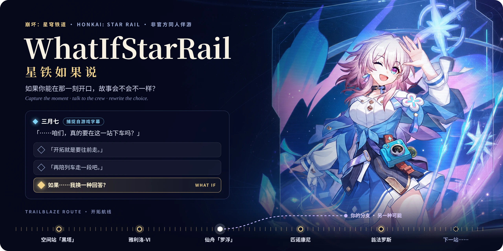
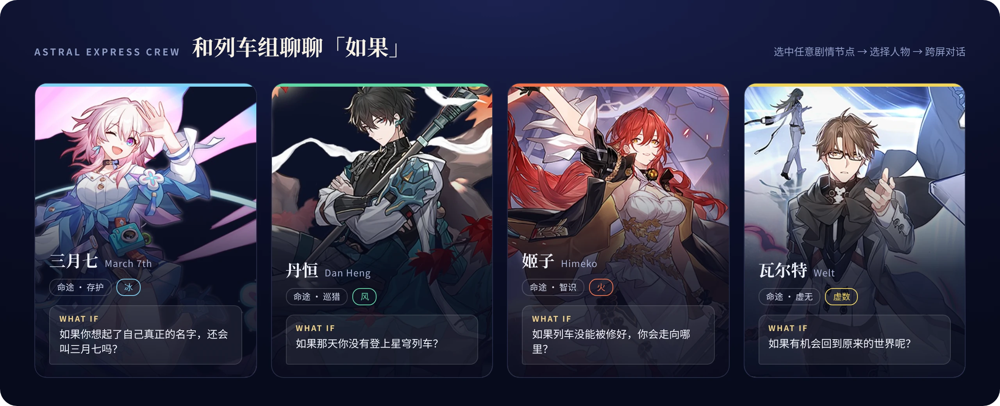
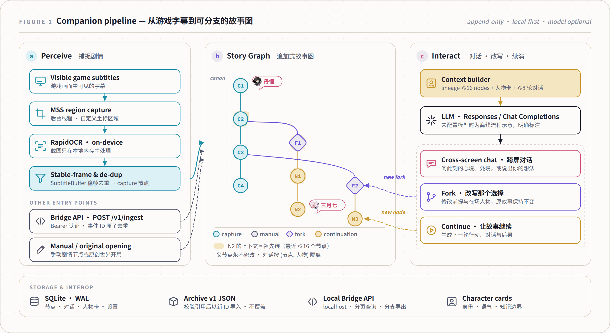
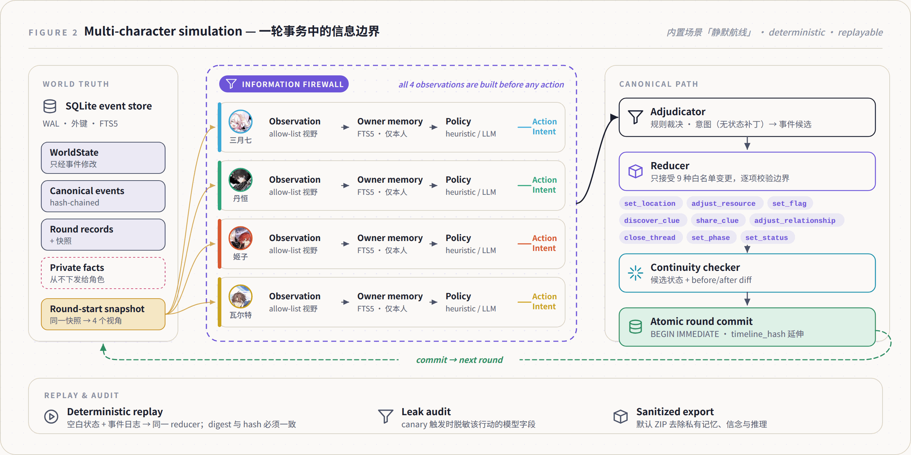

<div align="center">



<h3>如果你能在那一刻开口，故事会不会不一样？</h3>

<p>A local story companion for <b>Honkai: Star Rail / 崩坏：星穹铁道</b>.<br>
Capture the moment, talk to the characters, and explore what happens when the story takes a different turn.</p>

<p>
<a href="https://github.com/JaspinXu/WhatIfStarRail/stargazers"></a>


<a href="LICENSE"></a>
</p>

<p>
<a href="#快速启动"><b>快速启动</b></a> ·
<a href="#怎么玩"><b>怎么玩</b></a> ·
<a href="#工作原理"><b>工作原理</b></a> ·
<a href="#多人物模拟与-cli"><b>多人物模拟</b></a> ·
<a href="#配置"><b>配置</b></a> ·
<a href="docs/companion.zh-CN.md"><b>使用指南</b></a>
</p>

</div>

面向星铁玩家的「魔改剧情」工作台：捕捉游戏字幕，在当前剧情节点与人物对话，改写一个选择，或者从零构建全新的故事线。

> [!NOTE]
> 非官方本地伴游原型。故事改写保存在独立分支中，不会改变游戏客户端剧情或存档。默认离线模式可体验流程；情境化对话和完整故事生成需要配置模型。

## 和列车组聊聊「如果」



<table>
<tr>
<td width="50%" valign="top">

**捕捉此刻** · 主屏字幕区域预设与自定义坐标，后台 OCR 定时识别、稳帧去重，显示采集状态、帧数与延迟。

**跨越第四面墙** · 与选中节点中的人物对话，询问此刻的心境、处境，或说出你的想法。

**改写那个选择** · 从任意节点建立分支，修改剧情前提和在场人物，保留原故事。

**让故事继续** · 生成下一轮行动、对话和后果，反复续演，探索不同的可能。

**从零开局** · 手动输入任意任务节点或原创世界，自由指定人物与冲突。

</td>
<td width="50%" valign="top">

**保存你的故事** · SQLite（WAL）持久保存节点与聊天；按剧情、人物检索，面包屑与分支导航，比较父子节点差异，删除误识别的末端节点，校验导入与导出 JSON。

**定义人物声音** · 编辑角色的身份、语气和知识边界，生成时携带对应人物卡。

**接入其他工具** · 可选本地 API 提供字幕接入、事件去重、分页查询与分支导入导出。

**多人物模拟** · 保留独立观察、私有记忆、规则裁决、确定性状态更新、回放与泄漏审计的实验工作台。

</td>
</tr>
</table>

### v0.2 · 从剧情演示到伴游工作台

参考三月七小助手、StarRailCopilot、Fribbels 等项目的设备配置、运行仪表盘和数据管理方式，新增后台采集、持久化设置、剧情检索与校验导入、可编辑角色卡，以及有认证和去重机制的本地剧情 API。具体来源、星数快照与实现范围见 [开源生态调研](docs/ecosystem-review.zh-CN.md)。

## 怎么玩

| 你想做什么 | 操作 |
| --- | --- |
| 边玩边记录剧情 | 在「伴游控制台」保存并预览字幕区域，再启动后台捕捉 |
| 问问丹恒此刻在想什么 | 暂停捕捉，选中节点，在「跨屏对话」选择丹恒 |
| 如果这一次选择留下呢 | 在「故事档案」修改前提，创建分支并自然续演 |
| 写一段完全不同的星铁故事 | 手动建立开局，填写人物、地点、已知事实与矛盾 |
| 比较另一种可能 | 回到同一个祖先节点，创建第二条分支 |

人物心境和后续属于同人推演。模型上下文按选中分支组织，对话记录按节点和人物隔离。

## 快速启动

需要 **Python 3.11**，建议在独立虚拟环境中安装。从激活的环境执行：

```bash
git clone https://github.com/JaspinXu/WhatIfStarRail.git
cd WhatIfStarRail
python -m pip install -e ".[dev,capture,llm]"
whatifstarrail ui
```

打开 [星铁如果说工作台](http://localhost:8501/?mode=companion)。不使用截图或模型时，可只安装 `pip install -e ".[dev]"`。

安装后若终端未识别新命令，也可运行 `python -m astral_agents.cli ui`。侧栏可切换「星铁伴游」与「多人物模拟」。

### 实时字幕捕捉

1. 将游戏设为窗口化或无边框窗口，展开「字幕区域与后台采集」。
2. 输入字幕区域的屏幕像素坐标，包含说话人和台词，并填写在场人物。
3. 保存配置，点击「预览已保存的字幕区域」，确认范围后启动后台捕捉。
4. 暂停后选择节点进行对话和改写；切换任务时可开始新的捕捉时间线。

建议把伴游放在另一块屏幕，避免遮挡游戏字幕。采集发生在运行 Python 服务的电脑上；关闭浏览器页面后仍会继续，直到点击「停止捕捉」或退出 Python 服务。截图仅在本地进程中处理，不上传模型，也不持久保存。

## 工作原理

<p align="center">

</p>
<p align="center"><sub><b>Figure 1.</b> 伴游流水线。<b>(a)</b> 可见字幕经区域截图、本地 OCR 与稳帧去重成为 capture 节点，Bridge API 与手动开局是另外两个入口；<b>(b)</b> 追加式故事图，fork 与 continuation 永远作为新节点写入，父节点不变；<b>(c)</b> 生成时只携带当前分支的祖先链、人物卡与该人物在这些节点上的对话。</sub></p>

伴游使用追加式故事图：捕捉、改写、续演分别创建节点，父节点保持不变。它与原有规则模拟器分别保存数据；自由生成的故事不会写入模拟器的确定性事件日志。

伴游在线生成使用当前分支最近 16 个节点，以及这些节点中当前人物的最近 8 轮对话。长篇故事可手动建立摘要节点。生成失败会提示错误，不写入虚假后续；离线生成明确标注为流程示意。

| 层级 | 技术与职责 |
| --- | --- |
| 界面 | Streamlit，剧情接入、分支工作室、跨屏对话 |
| 捕捉 | 独立后台线程、MSS 区域截图、RapidOCR 本地识别 |
| 叙事 | 角色卡、离线示意 / Responses API / Chat Completions |
| 存储 | SQLite 故事图、按节点与人物隔离的对话 |
| 外部接入 | 可选 FastAPI，Bearer 认证、Pydantic schema、原子去重 |
| 模拟实验 | Pydantic 结构化行动、规则裁决、事件归约、私有记忆与审计 |

## 多人物模拟与 CLI

<p align="center">

</p>
<p align="center"><sub><b>Figure 2.</b> 一轮模拟事务。四名角色从同一个回合起始快照获得各自的 allow-list 观察，只能检索自己的记忆，产出不含状态补丁的 ActionIntent；裁决、白名单归约与连续性检查通过后才原子提交，事件日志可完整回放。</sub></p>

内置「静默航线」原创封闭调查场景，包含四名角色及完整的 10–12 轮流程。角色依据获准观察的信息和自身记忆行动，经过规则裁决的事件才会更新世界状态。

```bash
whatifstarrail validate
whatifstarrail run --policy heuristic --seed 42
whatifstarrail run --policy scripted --seed 42 --rounds 5
whatifstarrail step RUN_ID
whatifstarrail resume RUN_ID --rounds 3
whatifstarrail replay RUN_ID
whatifstarrail inspect RUN_ID --character dan_heng --round 3
whatifstarrail metrics RUN_ID
whatifstarrail export RUN_ID
```

模拟器支持暂停续跑、状态哈希验证、默认脱敏导出，以及显式选择的完整研究 trace 导出。见 [两分钟模拟演示](docs/demo_guide.zh-CN.md)、[架构](docs/architecture.md) 和 [实现记录](docs/implementation_plan.zh-CN.md)。

## 配置

启用模型前，在启动服务的终端设置环境变量。PowerShell 示例：

```powershell
$env:OPENAI_API_KEY = "你的密钥"
$env:ASTRAL_OPENAI_MODEL = "你有权限使用的模型名称"
whatifstarrail ui
```

macOS / Linux 使用 `export NAME="value"`。随后在「连接与设置」保存模型名称与协议，并打开侧栏「使用模型生成」。支持 Responses API 与 Chat Completions；界面保存的模型名称优先于环境变量。

| 变量 | 用途 |
| --- | --- |
| `OPENAI_API_KEY` | 在线模型凭据，仅从本地环境读取 |
| `OPENAI_BASE_URL` | 可选兼容端点，使用该服务对应的密钥 |
| `ASTRAL_OPENAI_MODEL` | 伴游生成与模拟策略使用的模型名称 |
| `ASTRAL_COMPANION_DATABASE` | 伴游数据库，默认 `runs/companion.sqlite` |
| `ASTRAL_DATABASE` | 多人物模拟数据库，默认 `runs/astral.sqlite` |
| `WHATIF_BRIDGE_TOKEN` | 可选桥接服务的 Bearer 令牌，至少 24 字符 |

### 接入外部字幕工具

安装 `pip install -e ".[bridge]"`，配置 `WHATIF_BRIDGE_TOKEN`，运行 `whatifstarrail bridge`。接口固定绑定 localhost；`POST /v1/ingest` 使用来源、时间线与事件 ID 追加剧情并处理重复投递。[完整接入示例与协议](docs/bridge-api.zh-CN.md)。这不是游戏官方剧情 API，也不直接兼容其他工具的原生数据格式。

## 验证

```bash
python -m pytest
python -m ruff check .
```

覆盖分支隔离、对话持久化、OCR 稳帧去重、后台采集停止与错误恢复边界、归档完整性、并发事件去重、API 认证、模型上下文边界、完整页面交互，以及模拟器回放一致性和导出行为。测试使用离线或模拟模型，不代表已验证真实游戏画面或在线模型质量。

## 当前边界

| 能力 | 当前状态 |
| --- | --- |
| 游戏剧情接入 | 读取可见字幕；不会读取隐藏任务状态或尚未显示的剧情 |
| OCR | 可能漏掉快速切换的台词；支持手动补录和创建校正分支 |
| 游戏内悬浮窗 | 尚未实现，当前使用游戏旁的浏览器工作台 |
| 故事生成 | 模型可能偏离设定或剧透，角色内心属于推演 |
| 导入导出 | 支持本项目 v1 归档，验证引用后以新 ID 导入；不覆盖已有节点 |
| 部署 | 面向单机个人使用，无多用户账户隔离 |

<details>
<summary><b>项目结构</b></summary>

```text
app/
  streamlit_app.py           品牌入口与多人物模拟台
  companion_ui.py           剧情接入、分支、角色对话
  companion.css             伴游工作台独立样式
  assets/                   角色素材与界面资源
src/astral_agents/
  companion.py              故事图、OCR 缓冲、对话与生成
  companion_models.py       节点、归档、角色卡与接入契约
  capture_service.py        后台采集生命周期与状态
  bridge_api.py             本地认证 API
  domain/                   数据模型与不变量
  simulation/               策略、规则裁决与确定性归约
  memory/                   私有记忆与检索
  storage/                  模拟事件与快照存储
  narrative/                已确认事件驱动的章节生成
  evaluation/               自动评估与审计
  cli.py                    命令行入口
scenarios/sealed_transport/ 内置原创调查场景
tests/                      单元、集成与页面测试
docs/                       使用指南、架构与实现记录
  assets/readme/            README 配图
runs/                       本地数据库（Git 忽略）
exports/                    模拟导出文件（Git 忽略）
```

</details>

<details>
<summary><b>改名与已有工作区</b></summary>

仓库、安装包和页面统一使用 **WhatIfStarRail · 星铁如果说**。推荐命令为 `whatifstarrail`，旧命令 `astral` 仍然可用。

为兼容已有脚本和数据，Python 导入路径 `astral_agents`、`ASTRAL_*` 环境变量和现有数据库文件名继续保留，无需迁移记录。已有克隆更新远端并重新安装即可；本地文件夹不必改名：

```bash
git remote set-url origin https://github.com/JaspinXu/WhatIfStarRail.git
python -m pip install -e ".[dev,capture,llm]"
```

</details>

## Star History

如果这个项目让你想起了某个「如果」，欢迎点一个 Star，让更多开拓者看到它。

<a href="https://star-history.com/#JaspinXu/WhatIfStarRail&Date">
  <picture>
    <source media="(prefers-color-scheme: dark)" srcset="https://api.star-history.com/svg?repos=JaspinXu/WhatIfStarRail&type=Date&theme=dark">
    
  </picture>
</a>

## 内容与授权

本项目是非官方、非商业研究与同人原型，与 HoYoverse 无隶属或背书关系。**Honkai: Star Rail / 崩坏：星穹铁道** 及其人物、世界观归相应权利人所有，生成故事不属于官方剧情。

内置调查场景、异常、线索与私有目标为原创实验内容；公开角色素材及来源见 [素材说明](app/assets/README.md)。README 配图中的角色立绘同样来自该目录的官方公开素材，仅作非商业展示。代码按 [MIT License](LICENSE) 发布，该许可不授予第三方角色素材的权利。
