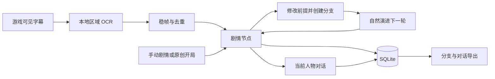

# WhatIfStarRail · 星铁如果说

**如果你能在那一刻开口，故事会不会不一样？**

A local story companion for **Honkai: Star Rail / 崩坏：星穹铁道**. Capture the moment, talk to the characters, and explore what happens when the story takes a different turn.

面向星铁玩家的「魔改剧情」工作台：捕捉游戏字幕，在当前剧情节点与人物对话，改写一个选择，或者从零构建全新的故事线。


> 非官方本地伴游原型。故事改写保存在独立分支中，不会改变游戏客户端剧情或存档。默认离线模式可体验流程；情境化对话和完整故事生成需要配置模型。

[快速启动](#快速启动) · [怎么玩](#怎么玩) · [配置](#配置) · [工作原理](#工作原理) · [验证](#验证) · [使用指南](docs/companion.zh-CN.md)

## 功能亮点

- **捕捉此刻：** 自定义字幕区域，本地 OCR 定时识别，连续两帧稳定后去重保存。
- **跨越第四面墙：** 与选中节点中的人物对话，询问此刻的心境、处境，或说出你的想法。
- **改写那个选择：** 从任意节点建立分支，修改剧情前提和在场人物，保留原故事。
- **让故事继续：** 生成下一轮行动、对话和后果，反复续演，探索不同的可能。
- **从零开局：** 手动输入任意任务节点或原创世界，自由指定人物与冲突。
- **保存你的故事：** SQLite 持久保存节点与聊天；导出当前分支及其对话为 JSON。
- **多人物模拟：** 保留独立观察、私有记忆、规则裁决、确定性状态更新、回放与泄漏审计的实验工作台。

## 怎么玩

| 你想做什么 | 操作 |
| --- | --- |
| 边玩边记录剧情 | 在「剧情接入」预览字幕区域，再开启自动捕捉 |
| 问问丹恒此刻在想什么 | 暂停捕捉，选中节点，在「跨屏对话」选择丹恒 |
| 如果这一次选择留下呢 | 在「分支工作室」修改前提，创建分支并自然续演 |
| 写一段完全不同的星铁故事 | 手动建立开局，填写人物、地点、已知事实与矛盾 |
| 比较另一种可能 | 回到同一个祖先节点，创建第二条分支 |

人物心境和后续属于同人推演。模型上下文按选中分支组织，对话记录按节点和人物隔离。

## 快速启动

需要 **Python 3.11**，建议在独立虚拟环境中安装。从激活的环境执行：

```bash
git clone https://github.com/JaspinXu/WhatIfStarRail.git
cd WhatIfStarRail
python -m pip install -e ".[dev,capture,llm]"
whatifstarrail ui
```

打开 [星铁如果说工作台](http://localhost:8501/?mode=companion)。不使用截图或模型时，可只安装 `pip install -e ".[dev]"`。

安装后若终端未识别新命令，也可运行 `python -m astral_agents.cli ui`。侧栏可切换「星铁伴游」与「多人物模拟」。

### 实时字幕捕捉

1. 将游戏设为窗口化或无边框窗口，展开「实时字幕捕捉」。
2. 输入字幕区域的屏幕像素坐标，包含说话人和台词，并填写在场人物。
3. 点击「预览字幕区域」，确认截取范围，再开启「开始自动捕捉」。
4. 暂停后选择节点进行对话和改写；切换任务时可开始新的捕捉时间线。

建议把伴游放在另一块屏幕，避免遮挡游戏字幕。采集发生在运行 Python 服务的电脑上，页面需保持连接。截图仅在本地进程中处理，不上传模型，也不持久保存。

## 配置

启用模型前，在启动服务的终端设置环境变量。PowerShell 示例：

```powershell
$env:OPENAI_API_KEY = "你的密钥"
$env:ASTRAL_OPENAI_MODEL = "你有权限使用的模型名称"
whatifstarrail ui
```

macOS / Linux 使用 `export NAME="value"`。随后打开侧栏「使用模型生成」。

| 变量 | 用途 |
| --- | --- |
| `OPENAI_API_KEY` | 在线模型凭据，仅从本地环境读取 |
| `ASTRAL_OPENAI_MODEL` | 伴游生成与模拟策略使用的模型名称 |
| `ASTRAL_COMPANION_DATABASE` | 伴游数据库，默认 `runs/companion.sqlite` |
| `ASTRAL_DATABASE` | 多人物模拟数据库，默认 `runs/astral.sqlite` |

伴游在线生成使用当前分支最近 16 个节点，以及当前人物在选中节点的最近 8 轮对话。长篇故事可手动建立摘要节点。生成失败会提示错误，不写入虚假后续；离线生成明确标注为流程示意。

## 工作原理



伴游使用追加式故事图：捕捉、改写、续演分别创建节点，父节点保持不变。它与原有规则模拟器分别保存数据；自由生成的故事不会写入模拟器的确定性事件日志。

| 层级 | 技术与职责 |
| --- | --- |
| 界面 | Streamlit，剧情接入、分支工作室、跨屏对话 |
| 捕捉 | MSS 区域截图、RapidOCR 本地识别 |
| 叙事 | 离线示意 / 可选 Responses API 模型生成 |
| 存储 | SQLite 故事图、按节点与人物隔离的对话 |
| 模拟实验 | Pydantic 结构化行动、规则裁决、事件归约、私有记忆与审计 |

## 多人物模拟与 CLI

内置「静默航线」原创封闭调查场景，包含四名角色及完整的 10–12 轮流程。角色依据获准观察的信息和自身记忆行动，经过规则裁决的事件才会更新世界状态。

```bash
whatifstarrail validate
whatifstarrail run --policy heuristic --seed 42
whatifstarrail run --policy scripted --seed 42 --rounds 5
whatifstarrail step RUN_ID
whatifstarrail resume RUN_ID --rounds 3
whatifstarrail replay RUN_ID
whatifstarrail inspect RUN_ID --character dan_heng --round 3
whatifstarrail metrics RUN_ID
whatifstarrail export RUN_ID
```

模拟器支持暂停续跑、状态哈希验证、默认脱敏导出，以及显式选择的完整研究 trace 导出。见 [两分钟模拟演示](docs/demo_guide.zh-CN.md)、[架构](docs/architecture.md) 和 [实现记录](docs/implementation_plan.zh-CN.md)。

## 验证

```bash
python -m pytest
python -m ruff check .
```

覆盖分支隔离、对话持久化、OCR 稳帧去重、模型上下文边界、完整页面交互，以及模拟器原子更新、记忆归属、回放一致性和导出行为。测试使用离线或模拟模型，不代表已验证真实游戏画面或在线模型质量。

## 当前边界

| 能力 | 当前状态 |
| --- | --- |
| 游戏剧情接入 | 读取可见字幕；不会读取隐藏任务状态或尚未显示的剧情 |
| OCR | 可能漏掉快速切换的台词；支持手动补录和创建校正分支 |
| 游戏内悬浮窗 | 尚未实现，当前使用游戏旁的浏览器工作台 |
| 故事生成 | 模型可能偏离设定或剧透，角色内心属于推演 |
| 导入导出 | 支持分支 JSON 导出，暂无 JSON 导入界面 |
| 部署 | 面向单机个人使用，无多用户账户隔离 |

## 项目结构

```text
app/
  streamlit_app.py           品牌入口与多人物模拟台
  companion_ui.py           剧情接入、分支、角色对话
  assets/                   角色素材与界面资源
src/astral_agents/
  companion.py              故事图、OCR 缓冲、对话与生成
  domain/                   数据模型与不变量
  simulation/               策略、规则裁决与确定性归约
  memory/                   私有记忆与检索
  storage/                  模拟事件与快照存储
  narrative/                已确认事件驱动的章节生成
  evaluation/               自动评估与审计
  cli.py                    命令行入口
scenarios/sealed_transport/ 内置原创调查场景
tests/                      单元、集成与页面测试
docs/                       使用指南、架构与实现记录
runs/                       本地数据库（Git 忽略）
exports/                    模拟导出文件（Git 忽略）
```

## 改名与已有工作区

仓库、安装包和页面统一使用 **WhatIfStarRail · 星铁如果说**。推荐命令为 `whatifstarrail`，旧命令 `astral` 仍然可用。

为兼容已有脚本和数据，Python 导入路径 `astral_agents`、`ASTRAL_*` 环境变量和现有数据库文件名继续保留，无需迁移记录。已有克隆更新远端并重新安装即可；本地文件夹不必改名：

```bash
git remote set-url origin https://github.com/JaspinXu/WhatIfStarRail.git
python -m pip install -e ".[dev,capture,llm]"
```

## 内容与授权

本项目是非官方、非商业研究与同人原型，与 HoYoverse 无隶属或背书关系。**Honkai: Star Rail / 崩坏：星穹铁道** 及其人物、世界观归相应权利人所有，生成故事不属于官方剧情。

内置调查场景、异常、线索与私有目标为原创实验内容；公开角色素材及来源见 [素材说明](app/assets/README.md)。代码按 [MIT License](LICENSE) 发布，该许可不授予第三方角色素材的权利。

