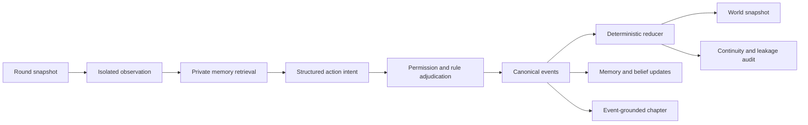

# Astral Narrative Agents

A reproducible multi-agent narrative simulation prototype with private observations, isolated memory, rule-based adjudication, deterministic world updates, replay, and leakage auditing.

The bundled “Silent Route” scenario places four configured characters in an original closed-room investigation. Each agent observes only permitted information, retrieves its own memories, proposes a structured action, and receives a rule-checked outcome. Confirmed events—not free-form prose—are the source of truth for world state and generated chapters.

> Runs fully offline by default. OpenAI-powered live decisions are optional.

## Star Rail companion / 星铁伴游

New: a local companion workspace for live subtitle OCR, conversations with characters at a selected story moment, immutable alternative branches, and open-ended continuation from any custom starting point.

```bash
python -m pip install -e ".[dev,capture,llm]"
python -m astral_agents.cli ui
```

Open `http://localhost:8501/?mode=companion`. Configure the subtitle rectangle and enable capture explicitly. Branches and character chats persist locally. Offline generation is a labeled workflow demo; contextual generation requires `OPENAI_API_KEY`, `ASTRAL_OPENAI_MODEL`, and the model toggle. Story changes live in the companion, not the game client. See [中文使用指南与限制](docs/companion.zh-CN.md).

## Highlights

- Four independently configured characters and one complete 10–12 round scenario.
- Separation of public facts, scenario truth, and character knowledge.
- Per-character observations, memories, beliefs, and evidence references.
- Structured action intents with permission, resource, location, and continuity checks.
- Deterministic reducer, round snapshots, SQLite event log, and reproducible seeds.
- Canary-based private-information leakage detection.
- Pause/resume, single-step execution, read-only replay, and state-hash verification.
- Redacted demo exports and full research-trace exports.
- Typer CLI and a Streamlit observation console.
- Optional Responses API policy with safe fallback to offline heuristics.

## System flow



Only whitelisted state changes in canonical events can update the world. Narrative chapters are read-only literary views over confirmed events.

## Quick start

### Requirements

- Python 3.11
- A virtual environment of your choice

```bash
git clone https://github.com/JaspinXu/astral-narrative-agents.git
cd astral-narrative-agents
python -m pip install -e ".[dev]"

python -m astral_agents.cli validate
python -m astral_agents.cli run --seed 42
python -m astral_agents.cli ui
```

On the original Windows development setup, `scripts/start.ps1` can launch the configured Conda environment directly. Public users do not need that exact environment name or filesystem path.

## CLI

```text
astral validate
astral run --policy heuristic --seed 42
astral run --policy scripted --seed 42 --rounds 5
astral step RUN_ID
astral resume RUN_ID --rounds 3
astral replay RUN_ID
astral inspect RUN_ID --character dan_heng --round 3
astral metrics RUN_ID
astral export RUN_ID
astral ui
```

The default database is `runs/astral.sqlite`; exports are written to `exports/`. Generated run artifacts are excluded from Git.

## Optional OpenAI policy

Install the LLM extra and set credentials through the environment:

```bash
python -m pip install -e ".[dev,llm]"
export OPENAI_API_KEY="..."
export ASTRAL_OPENAI_MODEL="your-available-model"
python -m astral_agents.cli run --policy llm --seed 42
```

In PowerShell, use `$env:NAME = "value"` instead of `export`.

The model sees only the current character's public behavior rules, goals, filtered observation, and retrieved private memory. It proposes a structured intent but cannot write state directly. Invalid evidence, schema failures, or API outages are traced and fall back safely to an offline policy.

## Testing

```bash
pytest
ruff check .
```

Regression coverage includes reducer atomicity, memory ownership, evidence visibility, canary leakage, pause/resume equivalence, deterministic state and event hashes, offline end-to-end execution, replay integrity, and redacted export behavior.

## Project structure

```text
app/                         Streamlit observation console
scenarios/sealed_transport/  Scenario, characters, facts, and opening events
src/astral_agents/
  domain/                    Pydantic schemas and invariants
  simulation/                Policies, adjudication, reducer, checks, engine
  memory/                    Private memory and source-aware retrieval
  storage/                   SQLite/FTS5 events, snapshots, and recovery
  narrative/                 Event-constrained chapter generation
  evaluation/                Automated metrics
  cli.py                     Typer CLI
tests/                       Unit, integration, and acceptance tests
docs/                        Architecture and demo documentation
```

Further reading:

- [Two-minute demo guide](docs/demo_guide.zh-CN.md)
- [Architecture](docs/architecture.md)
- [Implementation plan](docs/implementation_plan.zh-CN.md)

## Content and IP boundary

The repository stores only the minimum public character facts needed for the experiment, with source URLs. The transport, anomaly, private goals, clues, and generated chapters are original experimental content. The limited official character media used by the demo UI is attributed in `app/assets/README.md`.

This is an unofficial, non-commercial research/fan prototype with no affiliation with or endorsement by HoYoverse. *Honkai: Star Rail* and its characters and setting belong to their respective rights holders; generated original events are not official story content.

