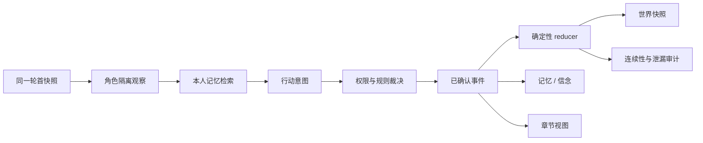

# Astral Narrative Agents

一个已经可运行、可单步、可回放的多智能体叙事研究原型。四名角色在原创封闭场景“静默航线”中分别观察、检索私有记忆、提出行动；系统先做权限校验与规则裁决，再以确定性事件更新世界，并将已确认事件转换为可追溯章节。

> 默认模式完全离线，不需要 API Key。OpenAI 实时决策是可选增强项。

## 原型现状

- 4 名配置化角色：三月七、丹恒、姬子、瓦尔特
- 1 个原创封闭调查场景、7 条线索、3 条待解决悬念
- 10–12 轮完整任务闭环，固定种子可复现
- 公开设定、场景真相、角色认知三层分离
- 角色独立 Observation、私有记忆、信念与证据事件引用
- 白名单状态变更、确定性 reducer、逐轮快照与 SQLite 事件日志
- canary 泄漏、不可见证据、资源、地点和连续性检查
- 每 3 轮生成一个仅来自已确认事件的章节
- 单步、连续运行、暂停恢复、只读回放和状态摘要校验
- 默认脱敏 ZIP 导出与完整研究 trace 导出
- Typer CLI 和 Streamlit “深空黑匣子观测台”
- 可选 OpenAI Responses API 结构化决策，失败时安全回退离线策略

## 快速开始

本项目固定使用本机 Conda 环境 `pytorch_env`，不要为本项目创建或切换到其他虚拟环境。
该环境当前使用 Python 3.11。

```powershell
conda activate pytorch_env
cd D:\astral-narrative-agents

# 确认输出路径包含 \envs\pytorch_env\
python -c "import sys; print(sys.executable)"

python -m pip install -e ".[dev]"

python -m astral_agents.cli validate
python -m astral_agents.cli run --seed 42
python -m astral_agents.cli ui
```

也可以在项目根目录直接运行固定环境启动脚本；即使当前 shell 没有激活环境，
脚本也只会通过 `pytorch_env` 启动界面：

```powershell
.\scripts\start.ps1
```

界面启动后：

1. 点击左侧“快速演示”直接加载完整 10 轮轨迹；
2. 在“角色视角”比较角色真正知道的信息；
3. 在“回放”拖动轮次，检查状态变化和确定性摘要；
4. 在“章节与导出”查看 4 个章节并下载脱敏演示包。

## CLI

```text
astral validate
astral run --policy heuristic --seed 42
astral run --policy scripted --seed 42 --rounds 5
astral step RUN_ID
astral resume RUN_ID --rounds 3
astral replay RUN_ID
astral inspect RUN_ID --character dan_heng --round 3
astral metrics RUN_ID
astral export RUN_ID
astral ui
```

默认数据库是 `runs/astral.sqlite`，默认导出目录是 `exports/`。两个目录中的运行产物不会进入 Git。

## 可选 OpenAI 实时决策

离线策略足以演示全部功能。若要让角色实时生成 `ActionIntent`：

```powershell
conda activate pytorch_env
python -m pip install -e ".[dev,llm]"
$env:OPENAI_API_KEY = "..."
$env:ASTRAL_OPENAI_MODEL = "gpt-5.6-sol"
python -m astral_agents.cli run --policy llm --seed 42
```

LLM 只能读取该角色的公开行为规则、目标、权限过滤观察和本人检索记忆；它只能提出结构化意图，不能直接生成状态 patch。解析失败、引用不可见事件或 API 不可用时会记录 trace 并回退到离线策略。密钥不会写入数据库或导出文件。

## 核心流程



世界状态只能由 `CanonicalEvent` 中的白名单 `StateChange` 更新。叙事章节是事件日志的文学化只读视图，不能反向修改世界。

## 测试

```powershell
pytest
ruff check .
```

关键回归覆盖：

- reducer 不原地修改输入，非法变更不产生部分提交；
- 其他角色的私密事实与 canary 不进入 Observation；
- canary 实际写入各自私有记忆，任何行动字段复述都会阻断并在脱敏导出中整项净化；
- 不可见事件 ID 不能作为行动证据；
- 记忆查询始终按 `run_id + owner_id` 隔离；
- 运行 5 轮后恢复与连续运行结果一致；
- 同一配置与种子得到相同状态摘要和事件链哈希；
- 完整离线演示成功、生成 4 章，回放状态摘要、时间线哈希与事件双写一致；
- 默认导出不包含私密事件载荷、记忆或决策理由。

## 项目结构

```text
app/                         Streamlit 叙事观测台
scenarios/sealed_transport/  场景、角色、公开事实与开场事件
src/astral_agents/
  domain/                    Pydantic schema 与不变量
  simulation/                观察、策略、裁决、reducer、检查、引擎
  memory/                    私有记忆形成与来源化检索
  storage/                   SQLite/FTS5 事件、快照与恢复
  narrative/                 事件约束的章节生成
  evaluation/                自动评测指标
  cli.py                     Typer 命令行
tests/                       单元、集成与原型验收测试
docs/                        架构、演示与原始技术路线
```

更多内容：

- [两分钟演示指南](docs/demo_guide.zh-CN.md)
- [实现架构](docs/architecture.md)
- [技术路线与后续扩展](docs/implementation_plan.zh-CN.md)

## 内容与知识产权边界

本项目只保存实验所需的最小公开角色事实与来源 URL。角色语言风格参数属于原型建模推导，不是官方数值；运输舰、异常、私有目标、线索和章节全部是原创实验内容。

本项目不包含或再分发官方游戏脚本、语音、角色模型、立绘、CG、Logo、字体或长段台词，也不使用泄露、测试服或未公开材料。

> 本项目为非官方、非商业的研究与同人原型，与 HoYoverse 无隶属或授权关系。《崩坏：星穹铁道》及其角色和世界观相关权利归相应权利人所有；系统生成的原创事件和章节不属于官方剧情。
