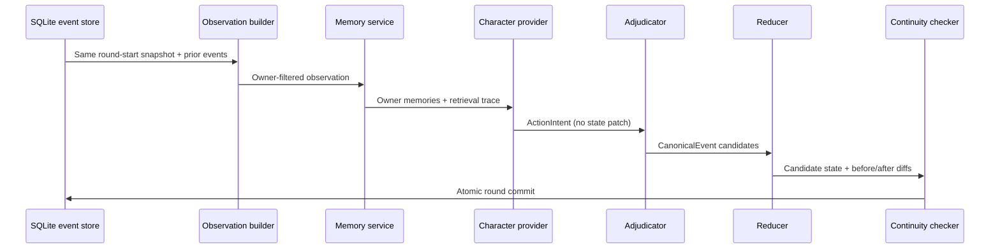

# Prototype Architecture

## Design objective

The prototype is built around one invariant: a character may act on incomplete or wrong beliefs, but it may never receive information outside its authorized observation and memory boundary.

The implementation deliberately uses a native Python orchestration loop for the prototype. LangGraph, FastAPI, Phoenix, SQLAlchemy and vector storage remain extension points rather than prerequisites.

## Information layers

| Layer | Owner | Mutability | Runtime access |
|---|---|---|---|
| Canon facts | Scenario bundle | Frozen | A character receives only its own minimal public profile |
| Scenario truth | `WorldState` + canonical events | Event-only | Reducer and researcher views |
| Character belief | Owner-scoped memories and beliefs | Evidence-linked | Only the owner; researcher audit is explicit |

Private scenario facts are never hidden with UI-only controls. `build_observation(character_id, ...)` constructs an allow-listed packet before any decision provider is called.

## Round transaction

All four observations are built before any action is applied. This prevents character iteration order from changing what later characters see within the same round.

## Determinism

- The offline policy uses a local actor-specific random source derived from `seed + round + actor_id`.
- Event IDs are stable for a given action order.
- Dictionaries are serialized with stable key ordering.
- The state digest excludes operational `run_id` and the chain hash.
- Each event extends a `timeline_hash`.
- Every committed round stores the complete typed `RoundRecord` and a `WorldState` snapshot.
- Replay rebuilds a blank initial state from the scenario and seed, reads every
  canonical event (including round-0 briefings) from the event table, and applies
  them through the same reducer.
- Acceptance requires the final state digest, timeline hash and the duplicate
  event copies inside round records to agree; changing only one persisted source
  therefore fails replay.

LLM runs are auditable but are not claimed to be byte-for-byte reproducible. Once generated, their confirmed event log still replays deterministically.

## State mutation boundary

Decision providers cannot construct arbitrary JSON Patch. The reducer accepts only:

- `set_location`
- `adjust_resource`
- `set_flag`
- `discover_clue`
- `share_clue`
- `adjust_relationship`
- `close_thread`
- `set_phase`
- `set_status`

Unknown kinds are rejected by Pydantic before adjudication. Every change is validated again against known characters, locations, resources, clues and bounds.

## Storage

SQLite runs in WAL mode with foreign keys and `BEGIN IMMEDIATE` round transactions. The schema persists:

- runs and manifests
- actions and canonical events
- round records and world snapshots
- owner-scoped memories and beliefs
- FTS5 memory text/tags
- retrieval hits
- narrative episodes
- validation findings

The prototype retrieval service reads only `(run_id, owner_id)` candidates, then ranks by relevance, goal match, salience, recency and relationship tags.

## Optional OpenAI provider

The provider uses structured output parsed into a narrow `DecisionDraft`. Actor ID, round number and action ID are assigned by application code. The model receives no `WorldState`, no other character profile, no other memory collection and no state-mutation tool.

If the API key is absent, the request fails, structured output is missing, or evidence references are illegal, the provider records an error trace and returns the offline fallback action.

## Export privacy

The default ZIP contains:

- `manifest.json`
- `events.jsonl`
- `world_snapshots.jsonl`
- `chapters.md`
- `metrics.csv`
- `README.txt`

The sanitized export removes private event payloads, private action content, rationales, memories, beliefs and researcher-only relationship state. If any action trips a canary, all model-authored fields in that action are redacted from the sanitized export while its audit skeleton remains. Full trace export is an explicit opt-in and still excludes environment variables and API credentials.
