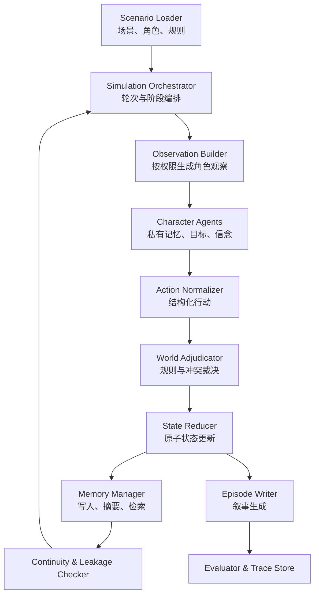

# 多智能体叙事模拟系统：原型实现方案计划书

> 项目代号：Palace Narrative Agents  
> 目标仓库：`JaspinXu/palace-narrative-agents`  
> 初始场景：架空王朝的历史幻想宫廷  
> 建议周期：10 周（可压缩为 6–8 周 MVP）

## 1. 项目目标

本项目拟实现一个由大语言模型驱动的多智能体叙事模拟原型。多个角色智能体拥有彼此隔离的记忆、目标、性格、信念与私密信息，在共享世界中按轮次观察、决策和互动；系统负责裁决行动、更新世界状态、检查信息边界与连续性，并将结构化模拟结果转化为连贯的短篇叙事章节。

首个可交付版本应支持：

- 4–6 个角色连续运行至少 20 轮；
- 每个角色具有独立的长期记忆、短期上下文、目标和信念状态；
- 世界状态能够追踪人物关系、阵营、资源、地点、事件和叙事约束；
- 角色只能基于其可见信息决策，系统能检测明显的信息泄漏；
- 每 3–5 轮生成一个可阅读的叙事片段，并保留可追溯的模拟日志；
- 使用固定测试场景对角色一致性、记忆、泄漏和叙事连贯性进行评测。

非目标：第一阶段不追求开放世界、实时多人游戏、完全自主的长篇小说生成，也不把向量数据库或复杂前端作为 MVP 的必要条件。

## 2. 研究问题

1. 私有记忆与角色信念隔离能否降低多智能体叙事中的信息泄漏？
2. 结构化的“决策—裁决—状态更新—叙事化”流程是否比自由对话更能维持长期连续性？
3. 哪种记忆策略能在成本、角色一致性和长期召回之间取得较好平衡？
4. 规则检查、LLM 检查和人工检查在叙事一致性评测中各自适合解决哪些问题？
5. 不同智能体编排框架对可控性、调试难度、延迟和复现实验有何影响？

## 3. MVP 场景设计

建议使用一个完全架空的“承曜朝”宫廷，避免把模型输出误认为真实历史。首轮设置 5 个角色：

| 角色 | 公开身份 | 核心目标 | 私密信息示例 |
|---|---|---|---|
| 皇帝 | 王朝统治者 | 维持权力与财政稳定 | 已知边军账目存在缺口 |
| 皇后 | 后宫与外戚代表 | 保护太子并压制政敌 | 掌握一封未公开密信 |
| 首辅 | 文官集团领袖 | 推动整顿并扩大文官权力 | 暗中保护涉案门生 |
| 大将军 | 军方领袖 | 确保军饷与边防自主权 | 对某次战报真实性存疑 |
| 御史 | 调查者 | 查清粮饷案并积累政治声望 | 拥有不完整的证词 |

开局事件可设为“边军粮饷失踪，朝会上出现相互矛盾的奏报”。该事件天然支持联盟、欺骗、调查、资源竞争和关系变化。

## 4. 总体架构



核心设计原则：

- **模拟真值与叙事文本分离**：结构化事件日志是唯一事实来源，叙事文本不能反向修改世界状态。
- **角色上下文隔离**：每个角色只接收公开状态、亲历事件、被告知内容和其自身记忆。
- **状态更新确定化**：LLM 提议更新，代码使用 schema 验证后以 reducer 方式应用。
- **全链路可追溯**：保存提示词版本、模型参数、输入摘要、结构化输出、状态 diff、token 与延迟。
- **先做简单编排**：MVP 优先使用清晰的 Python 状态机；当分支、重试和人工介入增多时再引入 LangGraph。

## 5. 技术选型

### 5.1 推荐栈

- Python 3.11+
- Pydantic v2：数据模型与结构化输出校验
- OpenAI Python SDK：LLM 调用、结构化输出与 tracing 基础
- LangGraph：第二阶段用于显式状态图、条件边、重试和中断恢复
- SQLite + SQLAlchemy/SQLModel：实验、轮次、事件、记忆和指标持久化
- pytest：单元、属性与回归测试
- Typer：命令行入口
- Streamlit：可选的研究演示界面
- Ruff + mypy：代码质量

### 5.2 框架比较策略

第一阶段不同时实现多个框架。先用原生 Python 建立可控基线，再选 LangGraph 重构一条完整链路。CrewAI 和 AutoGen 只在有明确研究问题时做最小对照实验，比较：

- 状态可见性和隔离能力；
- 失败重试与恢复；
- 运行 trace 的可解释性；
- 每轮延迟与 token 成本；
- 自定义裁决和评测的接入难度。

## 6. 核心数据模型

```python
class CharacterProfile(BaseModel):
    id: str
    public_bio: str
    personality: dict[str, float]
    strategic_preferences: list[str]
    secrets: list[str]
    initial_goals: list["Goal"]

class Belief(BaseModel):
    proposition: str
    confidence: float
    source_event_ids: list[str]
    last_updated_round: int

class Memory(BaseModel):
    owner_id: str
    kind: Literal["episodic", "semantic", "relationship", "goal"]
    content: str
    source_event_ids: list[str]
    salience: float
    visibility: Literal["private", "shared", "public"]

class WorldState(BaseModel):
    round_no: int
    locations: dict
    resources: dict
    relationships: dict[str, dict[str, float]]
    public_facts: list[str]
    active_constraints: list[str]

class ActionIntent(BaseModel):
    actor_id: str
    action_type: str
    target_ids: list[str]
    public_content: str | None
    private_content: str | None
    intended_effects: list[str]
    evidence_event_ids: list[str]

class CanonicalEvent(BaseModel):
    id: str
    round_no: int
    participants: list[str]
    observers: list[str]
    public_summary: str | None
    private_payloads: dict[str, str]
    state_patch: list[dict]
```

关系建议用有方向的连续变量表示，例如 `trust`、`fear`、`influence`、`obligation`，范围统一为 `[-1, 1]`；每次变化必须记录原因事件和变化量。

## 7. 单轮模拟流程

1. **轮次规划**：编排器根据当前冲突和场景节奏选择本轮地点、参与者与可用行动窗口。
2. **生成观察**：为每个角色构建权限过滤后的观察包，禁止传入全局私密状态。
3. **检索记忆**：按相关性、显著性、时间衰减和未解决目标选取有限条记忆。
4. **角色决策**：角色输出结构化 `ActionIntent`，并引用其决策依据对应的事件 ID。
5. **行动规范化**：将自由表达映射到有限的行动类型，例如谈判、调查、公开发言、秘密传递、资源调动。
6. **冲突裁决**：规则优先，LLM 仅处理语义或社会冲突；输出候选结果和置信度。
7. **应用状态更新**：校验 patch、检查不变量、原子提交，并生成 before/after diff。
8. **写入记忆与信念**：只向事件参与者、观察者或被告知者写入相应记忆。
9. **连续性检查**：检查角色越权知识、时间地点冲突、资源下溢、死亡角色行动等。
10. **叙事化**：按事件日志生成场景文本，禁止引入未在事件或允许推断集中出现的新事实。

## 8. 提示词与输出契约

每类模型调用独立维护模板和版本号：

- `character_decision_v1`：角色身份、目标、当前信念、可见观察、检索记忆、可选行动；
- `adjudication_v1`：冲突行动、硬规则、相关世界状态、随机种子结果；
- `memory_update_v1`：事件事实、角色视角、情绪影响、应写入的记忆类型；
- `continuity_check_v1`：事件日志、状态 diff、不变量、已知信息集合；
- `episode_writer_v1`：已确认事件、叙事视角、风格约束、不可新增事实列表。

所有决策类调用必须输出 JSON/Pydantic schema。对解析失败、缺字段或引用不存在事件 ID 的结果进行最多两次修复；仍失败则使用保守的 no-op 行动并记录错误。

角色提示中应明确要求“基于角色相信的事实行动”，而非基于系统真值行动。这样可以保留误解、谣言和欺骗带来的叙事空间。

## 9. 记忆与信息边界

### 9.1 三层记忆

- 工作记忆：当前轮观察、近期对话和活跃目标；
- 情节记忆：角色亲历或获知的具体事件，带来源与时间；
- 语义记忆：由多次事件归纳出的关系判断、人物印象和长期知识。

### 9.2 检索排序

`score = 0.45 × relevance + 0.25 × salience + 0.20 × goal_match + 0.10 × recency`

先用 SQLite 全文或关键词基线；只有当记忆规模明显增大时再引入 embedding。每次被检索的记忆 ID 写入 trace，以便判断角色行为究竟源于哪条记忆。

### 9.3 防泄漏机制

- 不把完整 `WorldState` 直接传给角色；
- 使用 `ObservationBuilder(character_id)` 生成白名单字段；
- 每个事件显式记录 `participants`、`observers` 和 `private_payloads`；
- 角色决策必须引用证据事件 ID；
- 检查引用是否属于该角色的知识集合；
- 用对抗测试注入只有单个角色知道的 canary secret，统计其他角色是否无来源提及。

## 10. 评测方案

### 10.1 指标

| 维度 | 自动指标 | 人工评测 |
|---|---|---|
| 角色一致性 | 与角色目标冲突的行动率；人格规则违背数 | 1–5 分角色可信度 |
| 信息泄漏 | 无可见来源的私密事实提及率 | 判断是否属于合理推断 |
| 长期记忆 | 延迟若干轮后的事实召回准确率 | 记忆是否自然影响行为 |
| 世界一致性 | schema/invariant 失败数；资源与时空冲突数 | 情节是否自洽 |
| 叙事连贯性 | 未铺垫实体率；事件覆盖率 | 因果连贯、节奏、可读性 |
| 成本性能 | 每轮 token、费用、延迟、失败重试率 | — |

### 10.2 实验设计

- 固定 3 个场景、5 个随机种子，每个配置运行 20 轮；
- 对照 A：只使用最近对话，无长期记忆；
- 对照 B：摘要记忆；
- 实验 C：事件记忆 + 检索 + 信念状态；
- 消融：关闭证据事件引用、关闭连续性检查、关闭行动规范化；
- 保存模型、温度、提示版本和随机种子，保证可复现；
- 人工评测采用匿名成对比较，并报告评分说明与一致性。

## 11. 仓库结构

```text
palace-narrative-agents/
├─ README.md
├─ pyproject.toml
├─ .env.example
├─ configs/
│  ├─ models.yaml
│  └─ experiments/
├─ scenarios/
│  └─ chengyao_court/
│     ├─ world.yaml
│     ├─ characters.yaml
│     └─ opening_events.yaml
├─ src/palace_agents/
│  ├─ domain/          # Pydantic 模型与不变量
│  ├─ agents/          # 角色决策逻辑
│  ├─ memory/          # 写入、摘要、检索
│  ├─ simulation/      # 编排、裁决、reducer
│  ├─ narrative/       # 连续性检查与叙事生成
│  ├─ evaluation/      # 指标、实验运行器
│  ├─ storage/         # SQLite 与 trace
│  └─ cli.py
├─ prompts/
├─ tests/
│  ├─ unit/
│  ├─ integration/
│  └─ scenarios/
├─ app/                # 可选 Streamlit 演示
├─ docs/
│  ├─ implementation_plan.zh-CN.md
│  ├─ architecture.md
│  └─ experiment_report.md
└─ runs/               # 默认 gitignore，仅保留示例
```

## 12. 里程碑与工作安排

### 第 1 周：需求冻结与可复现骨架

- 定义研究问题、MVP 边界和 5 个角色；
- 建立 Python 项目、配置、日志和测试；
- 完成核心 schema 与一个无 LLM 的脚本化模拟。

验收：可用固定行动运行 5 轮，输出状态 diff 和事件日志。

### 第 2 周：角色决策与权限观察

- 实现 `ObservationBuilder`；
- 接入一个 LLM，完成结构化决策；
- 增加 prompt 版本和调用 trace。

验收：角色无法在输入中看到未授权字段，解析失败可恢复。

### 第 3 周：裁决与世界状态更新

- 实现行动类型、冲突裁决和 reducer；
- 编写资源、关系、时空与角色状态不变量；
- 对关键 reducer 做单元测试。

验收：5 个角色可连续运行 10 轮且无非法状态。

### 第 4 周：私有记忆与信念

- 完成三层记忆、来源追踪、检索排序和信念更新；
- 加入 canary secret 泄漏测试。

验收：角色能在延迟 5 轮后引用相关旧事件，泄漏可被定位。

### 第 5 周：叙事生成与连续性检查

- 每 3–5 轮生成一节叙事；
- 检查新增事实、时空冲突、角色知识来源；
- 建立叙事文本到事件 ID 的映射。

验收：叙事覆盖主要事件，且未确认事实新增率低于预设阈值。

### 第 6 周：持久化与实验运行器

- SQLite 保存运行、事件、记忆、状态快照和指标；
- 支持从 checkpoint 恢复；
- 批量运行不同种子和配置。

验收：中断后可恢复；同配置、同种子能重放结构化流程。

### 第 7 周：评测基线与消融

- 实现一致性、泄漏、召回、连续性和成本指标；
- 运行记忆策略对照与关键模块消融；
- 抽取人工评测样本。

验收：自动生成对比表和失败案例集。

### 第 8 周：演示界面

- 用 Streamlit 展示角色卡、关系图、时间线、私有记忆和叙事章节；
- 提供单步执行、暂停、回放和导出。

验收：非开发者可启动场景、运行轮次并查看状态变化。

### 第 9–10 周：稳健性与报告

- 修复高频失败，增加回归场景；
- 总结框架选择、实验结果、局限与伦理风险；
- 准备研究 demo、技术报告或论文方法部分。

验收：完成可重复 demo、实验表格、失败分析和系统设计文档。

## 13. 测试与验收标准

MVP 完成定义：

- 5 个角色、20 轮、至少 4 个叙事章节；
- 结构化输出解析成功率不低于 95%（含一次修复）；
- 所有状态更新通过 schema 和不变量检查；
- 每个角色的记忆、信念和提示上下文可独立审计；
- canary secret 的无来源泄漏率有明确测量，关键泄漏能回溯；
- 同一实验配置能够保存、恢复和导出；
- 至少完成 3 种记忆配置或 2 个关键模块的对照实验；
- README 含安装、配置、运行、评测和数据隐私说明。

## 14. 风险与应对

- **角色同质化**：将人格描述转为可操作的偏好、禁忌和决策规则，并用冲突场景测试。
- **提示上下文膨胀**：限制检索条数，定期摘要，并把结构化状态与自然语言记忆分开。
- **信息泄漏**：白名单观察、来源引用、canary secret 和无权限字段单元测试四层防护。
- **状态漂移**：事件日志作为事实源，reducer 原子更新，叙事生成只读。
- **LLM 不稳定**：schema、重试、保守回退、固定种子与完整 trace。
- **成本超预算**：小模型负责规范化和检查，大模型只处理关键决策或叙事；缓存稳定输入。
- **历史人物敏感性**：采用“历史启发但完全架空”的角色和王朝，在文档中明确非史实重现。
- **评测主观性**：自动指标与盲评结合，公开 rubric，并报告评审一致性。

## 15. 第一阶段任务清单

第一周即可建立以下 issues：

1. Scaffold Python package, CI, lint and tests
2. Define domain schemas and world invariants
3. Author Chengyao Court scenario and five character cards
4. Implement permission-filtered observation builder
5. Implement structured character decision call
6. Implement action normalization and deterministic reducer
7. Add SQLite event store and checkpoints
8. Add private memory and evidence-source tracking
9. Build leakage and continuity evaluation suite
10. Generate episode text from canonical events
11. Add batch experiment runner
12. Build minimal Streamlit trace viewer

## 16. 预期成果

- 可运行的 Python 原型与演示界面；
- 架空宫廷场景、角色卡和可复现实验配置；
- 结构化运行日志、状态快照和叙事章节；
- 角色一致性、信息泄漏、长期记忆与叙事连贯性的评测结果；
- 技术报告，重点说明系统设计、实验结果、失败案例、局限和下一步研究方向。

若结果稳定，可进一步研究动态目标形成、角色反思、层级规划、人类导演介入、跨章节记忆压缩、因果图评测，以及多模型角色分工。
