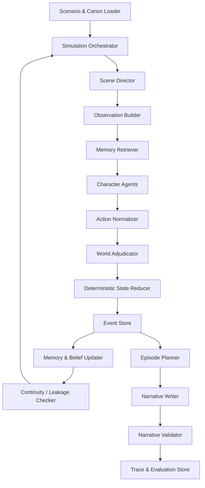

# WhatIfStarRail · 星铁如果说：技术路线与实现路径

> 项目性质：非官方、非商业的研究与同人原型  
> 研究主题：基于《崩坏：星穹铁道》公开角色设定的多智能体叙事模拟  
> 推荐周期：10 周  
> MVP 规模：4–6 个角色、20–30 轮模拟、4–6 个叙事章节

## 1. 项目目标

本项目拟实现一个由大语言模型驱动的多智能体叙事模拟系统。多个角色智能体在共享场景中持续观察、决策、沟通和行动，每个角色具有独立的：

- 公开设定与行为边界；
- 长期目标、短期目标和目标优先级；
- 私人记忆、关系记忆和当前信念；
- 仅对本人可见的秘密与误解；
- 对其他角色的信任、警惕、依赖和情感状态；
- 信息可见范围与知识来源。

系统需要维护场景的唯一真实状态，裁决多个角色的冲突行动，更新事件、资源、关系和记忆，并把已经确认的结构化事件生成连贯的原创叙事章节。

MVP 的重点不是最大化角色数量或文本长度，而是验证四个研究问题：

1. 角色是否能够在多轮互动中保持行为一致性；
2. 私有记忆和可见性控制是否能够防止信息泄漏；
3. 长期记忆是否能够正确影响后续行动；
4. 事件驱动的叙事生成是否能够维持世界状态与剧情连续性。

## 2. 范围与边界

### 2.1 MVP 范围

- 选择 4–6 名已有合理关系基础或可被同一任务召集的角色；
- 设计一个不修改原作主线、可在 20–30 轮内结束的原创封闭事件；
- 每轮允许角色进行观察、对话、调查、资源操作或移动；
- 每 3–5 轮生成一个叙事章节；
- 支持暂停、恢复、回放和导出；
- 对角色一致性、泄漏、记忆、连续性、成本与延迟进行评测。

### 2.2 暂不实现

- 覆盖全部角色、星球、阵营与主线剧情；
- 直接复现游戏战斗系统；
- 自动抓取或训练完整游戏脚本；
- 实时多人在线交互；
- 由 LLM 任意修改官方设定；
- 商业化发布或使用官方模型、语音、CG 等资产。

### 2.3 建议测试场景

初始场景应具备信息不对称、角色目标冲突和明确终止条件。建议使用“封闭空间中的异常调查”：

- 4–6 个角色因共同任务进入一艘暂时失联的运输舰；
- 舰内存在资源不足、通信受限、身份可疑者和互相矛盾的记录；
- 每个角色掌握不同线索或私人任务；
- 角色需要在合作、隐瞒、试探和资源分配之间做出选择；
- 场景在危机解除、任务失败或达到最大轮数时终止。

角色与地点应通过配置文件替换，不写死在核心代码中。

## 3. 核心设计原则

### 3.1 三层信息模型

系统必须严格分离：

1. **官方设定层 Canon Layer**  
   已公开、可追溯且在本次实验中不可由模型修改的角色与世界观事实。

2. **场景真值层 Scenario Truth Layer**  
   本次原创场景中真实发生的事件、资源、地点、关系和约束，是叙事生成的唯一事实源。

3. **角色信念层 Character Belief Layer**  
   每个角色认为真实的内容。信念可能错误、不完整或来自谣言，但必须记录来源和置信度。

角色智能体不能直接读取完整的 Canon Layer 或 Scenario Truth Layer，只能读取系统为其构建的权限过滤观察。

### 3.2 事件溯源

所有真实发生的变化必须来自规范化事件。世界状态是事件日志的当前投影，叙事文本只是事件日志的文学化视图。

模型生成的叙事不得反向写入世界状态。若叙事生成了事件日志中不存在的事实，只能标记为连续性错误，不能自动接受为新事实。

### 3.3 规则优先、模型补充

- 资源加减、地点移动、权限检查等确定性逻辑由代码执行；
- 角色决策、谈判意图、含义理解等开放语义问题交给 LLM；
- 冲突裁决先应用硬规则，再由 LLM 处理社会性或语义性结果；
- 所有 LLM 输出必须经过结构化 schema 校验。

### 3.4 可复现与可审计

每次运行需要保存：

- 模型名称、参数和供应商；
- prompt 模板版本；
- 场景和角色配置版本；
- 随机种子；
- 每一步输入、结构化输出和错误；
- 记忆检索结果及其来源；
- 世界状态 before/after diff；
- token、费用、延迟和重试次数。

## 4. 总体架构



### 4.1 组件职责

| 组件 | 输入 | 输出 | 是否调用 LLM |
|---|---|---|---|
| Scenario Loader | YAML/JSON 配置 | 初始世界与角色 | 否 |
| Scene Director | 当前冲突与节奏 | 本轮参与者和焦点 | 可选 |
| Observation Builder | 真值、事件权限 | 单角色观察包 | 否 |
| Memory Retriever | 目标、观察、记忆库 | 相关记忆 ID | 可选 |
| Character Agent | 角色上下文 | ActionIntent | 是 |
| Action Normalizer | 行动意图 | 标准行动类型 | 小模型或规则 |
| World Adjudicator | 多个行动与规则 | CanonicalEvent 候选 | 混合 |
| State Reducer | 已验证事件 | 新状态和 diff | 否 |
| Memory Updater | 事件与角色视角 | 记忆、信念变化 | 混合 |
| Continuity Checker | 状态、事件、知识集合 | 错误与严重度 | 规则优先 |
| Narrative Writer | 已确认事件 | 叙事章节 | 是 |
| Evaluator | trace 与基准集 | 指标和失败样本 | 混合 |

## 5. 推荐技术栈

### 5.1 核心

- Python 3.11+
- Pydantic v2：数据模型、JSON Schema、结构化输出校验
- LangGraph：轮次状态图、条件边、checkpoint、失败恢复
- OpenAI Python SDK 或兼容模型客户端：角色决策与叙事生成
- Typer：CLI
- pytest、Hypothesis：单元测试、性质测试和回归测试
- Ruff、mypy：代码质量

### 5.2 数据与记忆

- SQLite + SQLAlchemy/SQLModel：MVP 持久化
- SQLite FTS5：关键词和全文记忆检索
- PostgreSQL + pgvector：第二阶段语义检索和并发扩展
- Alembic：数据库迁移

向量数据库不是 MVP 前置条件。第一阶段应优先证明事件来源、信息权限、记忆写入和检索策略正确。

### 5.3 API 与界面

- FastAPI：模拟控制和查询 API
- Streamlit：第一版研究演示
- React/Next.js：需要复杂时间线、关系图和多面板调试时再引入
- NetworkX 或 Cytoscape.js：关系与因果图

### 5.4 可观测性与评测

- Arize Phoenix：OpenTelemetry trace、数据集、实验和评测
- LangSmith：如果 LangGraph 集成更方便，可作为替代
- pytest snapshot / golden cases：结构化状态回归
- pandas、Jupyter：实验分析

### 5.5 框架对照

主路线采用“原生 Python reducer + LangGraph 编排”。对照实验最多选择一个：

- OpenAI Agents SDK：比较 handoff、session、guardrail 与 tracing；
- AutoGen AgentChat：比较 group chat、GraphFlow 和 team orchestration；
- CrewAI：比较 crew 自治与 flow 编排。

框架只负责调用和编排。官方设定、场景真值、角色信念、权限和事件日志必须由项目代码显式控制。

## 6. 数据模型

### 6.1 官方设定

```python
class CanonFact(BaseModel):
    id: str
    subject_id: str
    predicate: str
    value: str
    source_url: str
    source_version: str
    confidence: Literal["official", "verified_summary"]
    immutable: bool = True
```

只收录实验真正需要的最小事实集，不构建完整百科。

### 6.2 角色

```python
class CharacterProfile(BaseModel):
    id: str
    display_name: str
    public_summary: str
    values: list[str]
    behavioral_rules: list[str]
    hard_constraints: list[str]
    strategic_preferences: list[str]
    speech_style: dict[str, str | float]
    private_facts: list[str]
    goals: list["Goal"]
```

`speech_style` 只保存正式程度、句长、直接程度、幽默倾向等抽象特征，不保存大量原作台词。

### 6.3 信念与记忆

```python
class Belief(BaseModel):
    id: str
    owner_id: str
    proposition: str
    confidence: float
    stance: Literal["believes", "doubts", "disbelieves"]
    source_event_ids: list[str]
    last_updated_round: int

class Memory(BaseModel):
    id: str
    owner_id: str
    kind: Literal["episodic", "semantic", "relationship", "goal"]
    content: str
    source_event_ids: list[str]
    salience: float
    emotional_valence: float
    visibility: Literal["private", "shared", "public"]
    created_round: int
```

### 6.4 行动和事件

```python
class ActionIntent(BaseModel):
    actor_id: str
    action_type: Literal[
        "speak", "ask", "reveal", "conceal", "investigate",
        "move", "use_resource", "negotiate", "assist", "oppose", "wait"
    ]
    target_ids: list[str]
    public_content: str | None
    private_content: str | None
    intended_effects: list[str]
    evidence_event_ids: list[str]
    confidence: float

class CanonicalEvent(BaseModel):
    id: str
    round_no: int
    event_type: str
    participants: list[str]
    observers: list[str]
    public_summary: str | None
    private_payloads: dict[str, str]
    state_patch: list["PatchOperation"]
    caused_by_action_ids: list[str]
```

### 6.5 世界状态

```python
class WorldState(BaseModel):
    run_id: str
    round_no: int
    phase: str
    locations: dict[str, str]
    resources: dict[str, float]
    relationships: dict[str, dict[str, "RelationshipState"]]
    active_conflicts: list[str]
    open_threads: list[str]
    public_fact_ids: list[str]
    constraints: list[str]
```

关系是有方向的。例如 A 信任 B 不代表 B 信任 A。建议至少追踪 `trust`、`suspicion`、`affinity`、`obligation` 和 `influence`，统一限制在 `[-1, 1]`。

## 7. 单轮执行流程

### 阶段 1：选择场景焦点

Scene Director 基于未解决冲突、角色目标和叙事节奏选择本轮参与者、地点、优先事件与可用行动窗口。

MVP 可先采用确定性轮转，避免导演模型同时承担过多控制权。

### 阶段 2：构建角色观察

`ObservationBuilder(character_id)` 只输出：

- 当前可见地点与在场角色；
- 公开事件；
- 角色亲历事件；
- 明确发送给该角色的私人信息；
- 角色自身状态；
- 允许感知的资源和风险。

禁止把完整 `WorldState`、其他角色私有记忆或隐藏目标传入角色 prompt。

### 阶段 3：检索记忆

建议检索分数：

```text
score =
  0.35 × relevance
+ 0.25 × goal_match
+ 0.20 × salience
+ 0.10 × recency
+ 0.10 × relationship_match
```

检索前先按 `owner_id` 和可见性过滤。每次检索必须保存命中的记忆 ID 和分数。

### 阶段 4：生成角色行动

每个角色输出一个 `ActionIntent`。提示词包含：

- 稳定角色规则；
- 当前目标与优先级；
- 过滤后的观察；
- 检索到的记忆；
- 当前信念；
- 可用行动类型；
- 必须引用的证据事件 ID。

角色可选择错误行动，但不能使用其不知道的信息。

### 阶段 5：行动规范化与冲突裁决

- 先验证 schema、角色权限、资源和地点；
- 合并兼容行动；
- 标记竞争同一资源、互相阻止或条件矛盾的行动；
- 先用确定性规则裁决；
- 仅把无法由规则处理的社会语义冲突交给裁决模型；
- 裁决输出事件候选，而不是直接生成章节。

### 阶段 6：应用状态更新

State Reducer：

- 校验 patch 路径；
- 检查资源不能低于允许范围；
- 检查角色不能同时处于多个地点；
- 检查事件参与者与观察者权限；
- 生成 before/after diff；
- 在同一事务中写入状态快照和事件。

### 阶段 7：更新记忆和信念

同一事件可为不同角色生成不同记忆：

- 参与者获得细节记忆；
- 观察者获得可见部分；
- 被转述者获得带来源的二手记忆；
- 未知情角色不写入任何相关内容。

信念更新必须保留旧值、证据来源和置信度变化。

### 阶段 8：连续性与泄漏检查

检查项包括：

- 行动引用了角色不可见的事件；
- 角色知道其他人的秘密；
- 地点、时间或资源矛盾；
- 行动违反不可变官方设定；
- 关系变化没有来源；
- 已关闭悬念被无原因重新打开；
- 叙事文本引入未确认事实。

严重错误阻断提交；一般问题写入警告并进入失败案例集。

## 8. 叙事生成

叙事生成分两步：

1. `EpisodePlanner` 将 3–5 轮事件整理为场景顺序、视角、冲突和结尾钩子；
2. `NarrativeWriter` 只根据计划和已确认事件写作。

输出章节必须附带：

- 覆盖的事件 ID；
- 使用的角色视角；
- 新增推断列表；
- 连续性检查结果。

Narrative Validator 检查：

- 是否遗漏关键事件；
- 是否出现来源不明的新事实；
- 是否把角色内心错误地写成世界真值；
- 是否大量复现原作对白或官方文案；
- 是否将原创情节误称为官方剧情。

## 9. Prompt 体系

建议目录：

```text
prompts/
├─ character_decision/
│  ├─ system_v1.jinja2
│  └─ user_v1.jinja2
├─ adjudication/
├─ memory_update/
├─ continuity_check/
├─ episode_plan/
└─ narrative_writer/
```

每个模板具有：

- 唯一版本号；
- 输入 schema；
- 输出 schema；
- 允许和禁止的信息；
- 失败回退策略；
- 对应的回归测试集。

解析失败时最多修复两次。仍失败则返回可解释的保守行动，例如 `wait`，不得让未校验文本进入状态更新。

## 10. 存储设计

SQLite MVP 表：

- `runs`
- `rounds`
- `characters`
- `canon_facts`
- `world_snapshots`
- `actions`
- `events`
- `memories`
- `beliefs`
- `relationship_changes`
- `narrative_episodes`
- `model_calls`
- `evaluation_results`

世界状态每轮保存快照，事件单独追加。恢复时读取最近快照并重放其后的事件。

记忆内容可建立 FTS5 虚拟表。只有在以下情况出现时迁移到 pgvector：

- 单角色记忆超过数千条；
- 关键词检索召回明显不足；
- 需要多实验并发或服务化部署；
- 需要结构化过滤与语义搜索的混合检索。

## 11. 仓库结构

```text
WhatIfStarRail/
├─ README.md
├─ pyproject.toml
├─ .env.example
├─ configs/
│  ├─ models.yaml
│  └─ experiments/
├─ scenarios/
│  └─ sealed_transport/
│     ├─ scenario.yaml
│     ├─ characters.yaml
│     ├─ canon_facts.yaml
│     └─ opening_events.yaml
├─ src/astral_agents/
│  ├─ domain/
│  ├─ agents/
│  ├─ memory/
│  ├─ simulation/
│  ├─ narrative/
│  ├─ evaluation/
│  ├─ storage/
│  └─ cli.py
├─ prompts/
├─ tests/
│  ├─ unit/
│  ├─ integration/
│  ├─ regression/
│  └─ scenarios/
├─ app/
├─ docs/
│  ├─ implementation_plan.zh-CN.md
│  ├─ architecture.md
│  └─ experiment_report.md
└─ runs/
```

`runs/` 默认不提交真实 API 响应和完整私有 trace，只保留脱敏示例。

## 12. 实现路径

### 第 0 阶段：研究与内容准备（2–3 天）

- 确定 4–6 个角色和一个封闭事件；
- 建立最小官方设定事实表；
- 明确角色公开目标、隐藏目标和信息权限；
- 制作 20 个用于评测的设定问答和冲突案例；
- 写明非官方、非商业和内容来源政策。

完成标准：场景无需 LLM 也能由人工解释其规则、状态和终止条件。

### 第 1 周：项目骨架与核心 schema

- 建立 `pyproject.toml`、lint、type check 和 pytest；
- 实现 CanonFact、CharacterProfile、WorldState、ActionIntent、CanonicalEvent；
- 实现 YAML 配置加载与交叉引用校验；
- 编写一个完全脚本化的 5 轮模拟。

完成标准：固定行动能够生成事件、状态 diff 和快照。

### 第 2 周：事件存储与 reducer

- 建立 SQLite schema 和 repository 层；
- 实现事件追加、状态快照和 checkpoint 恢复；
- 实现移动、对话、调查和资源操作 reducer；
- 为世界不变量编写单元和性质测试。

完成标准：相同输入和随机种子产生相同结构化状态。

### 第 3 周：角色观察和结构化决策

- 实现 ObservationBuilder；
- 接入第一个 LLM；
- 实现 ActionIntent 结构化输出、验证、重试和保守回退；
- 保存模型调用 trace。

完成标准：角色 prompt 中不存在未授权字段，解析成功率达到 95% 以上。

### 第 4 周：私有记忆与信念

- 实现情节、语义、关系和目标记忆；
- 建立 FTS5 检索与排序；
- 实现信念置信度和证据来源；
- 为不同角色生成事件视角。

完成标准：角色能在延迟 5 轮后引用相关事件，且引用来源可追溯。

### 第 5 周：多角色冲突裁决

- 实现同步收集行动；
- 建立冲突分类和规则优先裁决；
- 对社会语义冲突接入裁决模型；
- 实现原子事务提交。

完成标准：5 个角色可连续运行 15 轮且无非法状态。

### 第 6 周：连续性和泄漏测试

- 建立知识集合检查；
- 注入单角色 canary secret；
- 实现地点、资源、事件顺序和官方设定检查；
- 建立严重度、阻断和警告策略。

完成标准：明显的秘密泄漏和无来源事件引用能够被自动检测。

### 第 7 周：章节规划与叙事生成

- 实现 EpisodePlanner 与 NarrativeWriter；
- 限制叙事输入为已确认事件；
- 建立事件覆盖和新增事实检测；
- 生成首个 20 轮、4 章节 demo。

完成标准：章节中的关键事实能映射回事件 ID。

### 第 8 周：批量实验和评测

- 建立固定场景、随机种子和配置矩阵；
- 对比无长期记忆、摘要记忆和事件检索记忆；
- 消融证据引用、连续性检查和行动规范化；
- 统计 token、费用、延迟、失败和重试。

完成标准：自动生成实验表、失败案例集和可复现配置。

### 第 9 周：可视化 demo

- 用 Streamlit 展示运行控制；
- 展示角色卡、关系图、时间线、事件日志和章节；
- 为研究者提供角色私有记忆调试视图；
- 支持暂停、单步、恢复和导出。

完成标准：非开发者能启动场景、执行轮次并解释状态变化。

### 第 10 周：稳健性与报告

- 修复高频失败；
- 增加回归案例；
- 完成人工盲评；
- 总结架构、实验、失败、局限和伦理风险；
- 准备 demo 和技术报告。

完成标准：达到 MVP 验收标准并完成可重复演示。

## 13. 评测方案

### 13.1 角色一致性

- 硬约束违反率；
- 与当前高优先级目标冲突的行动率；
- 无事件依据的人格或态度突变率；
- 人工 1–5 分角色可信度；
- 同一场景不同种子下的行为边界稳定性。

### 13.2 信息泄漏

- 无合法来源的私人事实提及率；
- 非法 evidence event ID 引用率；
- canary secret 泄漏率；
- 将推测表述为确定事实的比例。

### 13.3 长期记忆

- 延迟 5、10、20 轮的事实召回；
- 关键承诺和关系事件的召回；
- 错误信念在新证据后的修正率；
- 检索 precision@k 和人工相关性。

### 13.4 世界与叙事连续性

- schema 和世界不变量失败数；
- 时空、资源和因果冲突数；
- 章节关键事件覆盖率；
- 叙事新增未确认事实率；
- 未解决悬念的合理延续率。

### 13.5 原创性与内容边界

- 与官方文本的长片段重合检测；
- 大量复现原作对白的样本数；
- 未公开或无法验证资料引用数；
- 非官方声明是否出现在所有对外交付物。

### 13.6 成本与性能

- 每角色每轮 token；
- 每完整场景费用；
- p50/p95 每轮延迟；
- 模型调用失败和重试率；
- checkpoint 恢复时间。

## 14. 实验设计

至少运行：

- 3 个固定场景；
- 每场景 5 个随机种子；
- 每配置 20 轮；
- 3 种记忆策略；
- 2 个关键模块消融。

对照配置：

1. 仅最近对话，无长期记忆；
2. 定期摘要记忆；
3. 来源化事件记忆 + 检索 + 信念；
4. 关闭证据事件引用；
5. 关闭连续性检查。

人工评测采用匿名成对比较，评分者看不到模型或配置名称。

## 15. MVP 验收标准

- 4–6 个角色连续运行 20 轮；
- 生成至少 4 个章节；
- 所有结构化状态通过 schema；
- 状态 reducer 无未处理非法状态；
- 角色 prompt 不包含其他角色私有状态；
- 结构化输出解析成功率不低于 95%（含一次修复）；
- 每个角色的关键决策可追溯到观察或记忆；
- 明显 canary secret 泄漏可被检测；
- 章节关键事件覆盖率达到预设阈值；
- 运行可保存、暂停、恢复和导出；
- 实验可根据配置和随机种子复现；
- README、界面和报告包含非官方研究声明。

## 16. 主要风险与应对

| 风险 | 表现 | 应对 |
|---|---|---|
| 角色同质化 | 所有人采用相似策略 | 把人格转为行为规则、偏好和禁忌 |
| 信息泄漏 | 角色知道他人秘密 | 白名单观察、证据引用、canary 测试 |
| 状态漂移 | 文本与真值不一致 | 事件溯源、确定性 reducer、叙事只读 |
| 上下文膨胀 | token 和延迟快速增长 | 检索、摘要、分层记忆和上下文预算 |
| 模型不稳定 | JSON 失败、行动越权 | schema、重试、保守回退和回归测试 |
| 评测主观 | 结果难比较 | 自动指标、盲评、rubric 和固定数据集 |
| 过度依赖框架 | 无法解释状态变化 | 业务状态和规则独立于 agent 框架 |
| 内容侵权 | 复制官方文本或资产 | 最小公开事实集、改写、来源记录、非商业声明 |

## 17. 内容与知识产权要求

本项目必须明确标注：

> 本项目为非官方、非商业的研究与同人原型，与 HoYoverse 无隶属或授权关系。《崩坏：星穹铁道》及其角色和世界观相关权利归相应权利人所有；系统生成的原创事件和章节不属于官方剧情。

实施时：

- 只使用已经公开、可验证并记录来源的设定；
- 不使用泄漏、测试服或未经证实的资料；
- 不抓取或再分发完整游戏脚本、语音、角色模型、CG 和其他官方资产；
- 不把大量官方对白作为 few-shot 示例；
- 不将模型生成内容描述为官方事实；
- 若转为商业产品，先停止公开发布并重新进行授权和法律评估。

## 18. 第一批 GitHub Issues

1. Scaffold Python package, lint, typing and tests
2. Define core domain schemas and invariants
3. Author the first sealed-scenario configuration
4. Build the minimum canon fact registry
5. Implement event store and deterministic reducer
6. Implement permission-filtered observations
7. Add structured character decision generation
8. Implement private memory and belief tracking
9. Add multi-action conflict adjudication
10. Build leakage and continuity test suite
11. Generate narrative episodes from canonical events
12. Add batch experiment runner and metrics
13. Build Streamlit trace viewer
14. Write experiment report and failure analysis

## 19. 技术参考

- LangGraph：<https://reference.langchain.com/python/langgraph/overview>
- OpenAI Agents SDK：<https://openai.github.io/openai-agents-python/>
- Microsoft AutoGen：<https://microsoft.github.io/autogen/stable/>
- CrewAI：<https://docs.crewai.com/>
- Pydantic：<https://docs.pydantic.dev/latest/concepts/models/>
- SQLite FTS5：<https://www.sqlite.org/fts5.html>
- pgvector：<https://github.com/pgvector/pgvector>
- Arize Phoenix：<https://arize.com/docs/phoenix>
- LangSmith Evaluation：<https://docs.langchain.com/langsmith/evaluation-concepts>
- 《崩坏：星穹铁道》官网：<https://hsr.hoyoverse.com/>
- Fan Creations Guide：<https://www.hoyolab.com/article/17883171>

## 20. 最终建议

默认采用：

> **Python + Pydantic + 原生确定性 reducer + LangGraph + SQLite/FTS5 + FastAPI/Streamlit + Phoenix**

正确的实现顺序是：

> **先建立 schema、事件日志、权限和 reducer，再接入角色 LLM；先验证关键词记忆与来源追踪，再考虑向量数据库；先建立失败检测和评测，再扩展角色数量与故事长度。**

这样能够把最危险的状态漂移、信息泄漏和不可复现问题控制在系统底层，而不是依赖更长的提示词临时修补。
